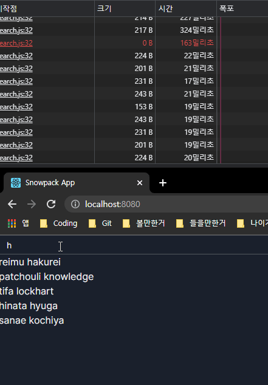
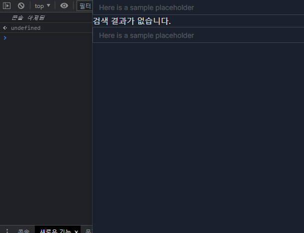

# auto-complete

대충 자동완성에 대한 간단한 고찰

## 자동완성?

일단 구글에 가서 자신이 원하는 검색을 대충 해보자.

자신이 원했던 검색이 검색창 밑에 주르륵 뜰것이다.

난 이걸 구현하려고 한다.

## 구현방법?

구현은 어렵지 않다.

파이썬일 경우는 ``in``

자바스크립트는 ``include``를 쓰면 쉽게 구현이 될것같다.

근데 문제는 이것이 아니다.

## 클라이언트 vs 서버

자동완성을 처리하는 주체가 누가 될것인지 매우 고민이 된다.

각각 장점과 단점이 있다.

### 클라이언트

말 그대로 클라이언트에게 처리하도록 냅둔다.

#### 장점

* 서버에 부담이 줄어든다!

#### 양날의검

* 사용자의 기기 사양을 탄다

### 서버

서버에서 처리한다.

#### 장점

* 클라이언트에 부담이 줄어든다!

#### 단점

* 서버비.... :(

## 그래서 뭘 골라야 하는건데?

사실 나도 몰?루

일단 제일먼저 구글을 한번 보았는데

검색어 칠때마다 서버에 요청후 결과값 받은걸 실시간으로 보여주었다.

근데 지금 내가 필요한 케이스하고 다르다.

구글 같은경우는 처리해야할 데이터가 워낙 방대하고

바뀔것도 많기 때문에 서버에서 처리하는것으로 예상된다.

하지만 나는 자동완성될 항목이 정해져있다.

이 말은 굳이 서버에서 진행할 필요가없다!

## 라고 할뻔...

원래 구현은 이렇게 생각했다.

자동완성 되어야할 단어들을 서버에서 준후 캐시.

클라이언트가 해당 단어를 처리해서 개멋있게 보여준다.

근데 지금 생각하니까 처리 해야할게 생각보다 많았다.

거의 몇십만개를 반복문돌려서 비슷한걸 찾아준다?

이야 이거만큼 자원 잡아 먹는게 없다고 ㅋㅋㅋㅋ

## 양자택일

뭘 고르든 하나는 악으로 깡으로 버터야한다.

서버의 사양이 그리 좋은것도 아니라서 클라이언트단에서 작업 하면 좋겠으나, 클라이언트 단에서 작업 하기에는 너무 양이 많다.

그리고 검색시에 단어가 들어가있는 항목의 갯수를 가져오는것도 고민해 보고있다.

사용자의 사양에 JavaScript를 믿을것인가 아니면 서버의 Python을 믿을건인가 고민을 하고 있었는데...

## 그런데 그때 몽고가 나타났다...

현재 서버는 MongoDB와 MariaDB 두개를 사용중이다.

MongoDB Atlas에서 배포중이여서 search함수를 잘 사용하고있었는데

거기에 https://docs.atlas.mongodb.com/reference/atlas-search/autocomplete/ 이런 귀한것이 있었다.

근데 이것도 문제가있었다.

사용자가 검색하는 형식과 디비에 저장되어있는 형식이 달라서 이를 변환하는 작업이 필요하다.

일단 몽고디비에 이런것이 있으니 서버사이드는 확실해 진것 같다.

## 이게 그렇게 쉽게 끝날리가있겠냐고 ㅋㅋㅋ

Atlas Search가 아직 기능들이 많이 개발중이다.

https://feedback.mongodb.com/forums/924868-atlas-search/suggestions/42349711-allow-autocomplete-search-on-multiple-fields-using

심지어 배열이 적용이 되지않아 지금 환경과는 맞지않아 조금 무리가 있다.

근데 제목검색을 돌려보니 결과는 만족스럽다. 추후에 많이 개발이되면 autocomplete를 써봐야할것같다.

## 다시 원점으로

아직 대안은 많다.

ElasticSearch를 쓰는것도 한 방법이고, 기존방법을 쓰는것도 방법중 하나이다.

일단 기존에 생각해둔 구현방법을 써보기로했다.

## 기존 구현

Python일경우 ``in`` 자바스크립트는 ``.include`` 구문을 사용해 작업해볼것이다.

18586 정도의 양으로 한번 테스트를 해볼것이다.

``result-korean-character`` 파일을 사용한다.

### Python

0.0122564초 정도 걸렸다.

### JavaScript

Node.js 기준 0.036초 정도 걸렸다.

### 기존 구현에 대한 결론

그렇게 신경 쓰이는 정도는 아닌거같다.

## 검증

실제로 웹서버와 웹페이지를 만들어서 검증했다.

### 서버에서 처리했을경우

### 웹에서 처리했을경우

## 기존에 생각한 방법으로 구현했을경우 정리

생각보다 깔끔하게 나와서 괜찮은것같았다.

하지만 로컬에 요청하고, 서버의 사양은 이보다 더 낮기 때문에 이를 감안 해야 할거같다.

그렇지만 이렇게 쓸만하다는것은 프로덕션에 올려도 나쁘지 않을것 같다고 본다.

하지만 이것으로 구현하게 된다면 오타가 난다면 못찾기 때문에,

ElasticSearch나 현재 MongoDB 구조를 바꿔서 Autocomplete 기능도 같이 써본후 비교할 계획이다.
